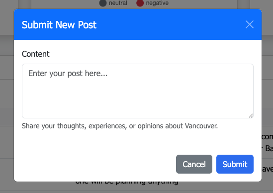

# CSCA-5028 - Applications of Software Architecture for Big Data - Final Project


This is the final project for the CSCA-5028 course ("Applications of Software Architecture for Big Data"),
taken as part of University of Colorado-Boulder's Master of Science in Computer Science online program,
by Andres Torres.

This report includes a high-level description of the project, a whiteboard architecture diagram with its description,
and recount of the design decisions made during the project. It will also include a list of implemented features, with
pointers to the relevant code sections.

The up-to-date code (as well as this report) is available at the [GitHub repository](https://github.com/aitorres/csca-5028-final-project), and
the deployed application is available as an [Azure Container App](https://web.mangoisland-c02529cd.westus3.azurecontainerapps.io/) (available during the semester).

> Note: the project implements logic to filter out inappropriate content from messages collected from Bluesky,
> but it might not be 100% effective. The application is intended for educational purposes only.

## How to run

To run the application locally, you will require [Docker Compose installed on your machine](https://docs.docker.com/compose/install/).

The [`docker-compose.yaml`](https://github.com/aitorres/csca-5028-final-project/blob/main/docker-compose.yaml) file
contains the required services to run the application (including all 3 main components as described below, as well as the database and message queue).

To run everything:

```bash
docker compose up --build
```

Once all services are up and running, you can access the web application at `http://localhost:8080`.

Data will be persisted to the `postgres-data` directory between sessions.

## Project description

**What's up in Vancouver?** is an application that tracks and displays information about social media
(and user-submitted) trends and opinions related to the city of Vancouver, Canada.

This application is targeted towards residents (and people interested in) the city of Vancouver who
want to stay informed about the public opinion and trends in the city, accessible in a single place
through a web application interface, and with sentiment analysis details.

The product's unique value is that data is sourced in an automated way by (anonymously) fetching posts from Bluesky, a
distributed social media platform, in real time. End-users can also submit their own posts, content or opinions about
the city through a form on the application's web interface. All posts are then analyzed for sentiment in real time and
displayed in a table.

Collected data is filtered to remove unwanted content, and a sentiment analysis library is used to enrich
the posts' data with a category (positive, negative, neutral).

## Architecture

The following whiteboard architecture diagram illustrates the high-level architecture of the project (including data stores, communication and external services):


The three main components of the architecture are:

- The **social media collector** application (code available here: [collector](https://github.com/aitorres/csca-5028-final-project/tree/main/collector)), a Python application that connects to the Bluesky social media platform through their posts stream (Jetstream) using web sockets, and collects posts that mention Vancouver in real time.
- The **post analyzer** application (code available here: [analyzer](https://github.com/aitorres/csca-5028-final-project/tree/main/analyzer)), a Python application that processes received posts to filter out unwanted content, enrich them with sentiment analysis, and stores them in a database.
- The **web application** (code available here: [web](https://github.com/aitorres/csca-5028-final-project/tree/main/web)), a web application built in Flask (back-end) and HTML / CSS / JavaScript (front-end) that displays the posts in a table as well as a few visualizations, and allows users to submit their own posts that are then sent to the post analyzer for processing.

The architecture is designed to be cloud-native, modular and scalable, with each component being independently deployable and scalable based on demand.

Communication between components is done through a RabbitMQ message queue system, with the **web** and **collector** sending messages to the **analyzer** for processing.

Data is persisted in a PostgreSQL database, which is used by the **analyzer** to store processed posts and by the **web** application to read them.

As described above, data is collected from an external source (Bluesky) as well as user-submitted posts, and processed in real time.

## Design decisions

The following is a recount of the most significant design decisions made during the project:

### Usage of a database for data persistence

To persist collected data, the project uses a PostgreSQL database. The current schema is very simple, with a single
table to store posts (with content, creation and insertion date, source and sentiment analysis category).

Given the simplicity of the data model, any robust and persistent data store would have sufficed. However, PostgreSQL was chosen for its robustness and scalability, in anticipation of new features that could require relationships between data entities in the future (e.g. storing information about users and tying posts to each author).

Another reason for choosing PostgreSQL is that it is widely used and supported in the industry, with most cloud providers offering managed PostgreSQL services, and most programming languages having libraries to interact with it.

The database schema can be found in the [migrations](https://github.com/aitorres/csca-5028-final-project/tree/main/migrations) directory.

### Usage of a message queue for communication between components

Given the modular nature of the architecture and the fact that each component has a very specific
responsibility, RabbitMQ was chosen as the message queue system to facilitate communication between components.

RabbitMQ allows for asynchronous communication between components, ideal for the architecture's design. Other features
of RabbitMQ, such as message persistence and delivery guarantees, are also beneficial for the architecture
to ensure that messages are not lost in case of failures. This is an advantage over using e.g. a REST API for communication, which would require more complex error handling and retries.

Using RabbitMQ also allows for easy scaling of components, as new instances of each component can be created
and destroyed independently without requiring to notify other components, as long as they are connected to the same message queue.

### Usage of Python as the main programming language

All main components of the application are written in Python. This language was chosen for its simplicity
and quick development cycle, as well as its rich ecosystem of libraries and frameworks that facilitate
both web applications and data analysis.

For the **web** component, Flask was chosen as a lightweight web framework, as most of the application logic
is implemented through REST APIs and rendering a template. More complex web frameworks such as Django would
be useful for larger, more complex applications.

For the data processing component, **nltk** was chosen as the natural language processing library that's been
battle-tested and includes a native sentiment analysis model. For more complex tasks, Python
offers a wide variety of libraries such as scikit-learn and spaCy.

Other relevant libraries used in the project include **pika** for RabbitMQ communication, **psycopg2** for PostgreSQL database interaction, and **websockets** for connecting to the Bluesky posts stream.

The project uses [Poetry](https://python-poetry.org/) for dependency management and packaging, which simplifies the process of managing dependencies and creating virtual environments.

### Containerization for portability and scalability

All components of the application are containerized using Docker, allowing for easy deployment in both
local environments (through Docker Compose) and cloud environments (e.g. through Azure Container Apps, or
an orchestration system like Kubernetes).

All application components are stateless so they can be scaled horizontally by adding more instances of each component as needed, and deleted without losing any data.

### Infrastructure as code

The project uses [Terraform](https://developer.hashicorp.com/terraform) to define the infrastructure required to run the application in the cloud. This includes deployment of all three main components (collector, analyzer, web), one virtual machine to run the PostgreSQL database and RabbitMQ instances, and the necessary networking and security configurations.

Defining the infrastructure as code allows for easy deployment and management of the application in the cloud,
as well as versioning and tracking of changes to the infrastructure. To set up the infrastructure from scratch,
one would only need to set up the Terraform variables (as shown [here](https://github.com/aitorres/csca-5028-final-project/blob/main/infrastructure/variables.tf)), then apply the Terraform configuration.

The only manual step required after the first deployment is to run the PostgreSQL migrations and apply the RabbitMQ definitions. Once that's done, all subsequent deployments can be done by running `terraform apply` again, which will only apply the changes made to the infrastructure.

The Terraform configuration files can be found in the [infrastructure](https://github.com/aitorres/csca-5028-final-project/tree/main/infrastructure) directory.

#### Cloud provider

All Terraform resources are defined to be deployed on Microsoft Azure, using Azure Container Apps for the three main components of the application, and a virtual machine for the PostgreSQL database and RabbitMQ instances due to the simplicity of the model.

The files are easily modifiable to deploy the PostgreSQL and RabbitMQ instances in a managed service, such as Azure Database for PostgreSQL and Azure Service Bus, requiring only to change environment variables
in the Azure Container Apps definitions for this to work.

## Features

The following is a brief list of the features implemented in the project, with pointers to the relevant code sections (note that some of these were described in the architecture section above):

### Web application with a basic form and reporting

The [web application](https://github.com/aitorres/csca-5028-final-project/tree/main/web) is built using Flask (back-end) and HTML/CSS/JavaScript (front-end). It includes data reporting through a data table and pie charts, and a form to submit user posts for processing.



### Data collection

[Automated data collection](https://github.com/aitorres/csca-5028-final-project/tree/main/collector) from the Bluesky social media platform is implemented using web sockets to listen to Bluesky's posts stream (Jetstream) in real-time.

### Data analyzer

[Data analysis](https://github.com/aitorres/csca-5028-final-project/tree/main/analyzer) is implemented using a Python application that processes received posts (both from Bluesky and user-submitted) to perform sentiment analysis (through **nltk**) and store content in a PostgreSQL database.

### Unit tests

All components of the application include unit tests to ensure correctness of the code. Tests are implemented using `pytest`, and can be run using the following command in each directory:

```bash
poetry run pytest
```

Test coverage includes most of the main application logic, testing for both valid and invalid inputs, and edge cases.

Tests can be found here: [web tests](https://github.com/aitorres/csca-5028-final-project/tree/main/web/tests), [collector tests](https://github.com/aitorres/csca-5028-final-project/tree/main/collector/tests) and [analyzer tests](https://github.com/aitorres/csca-5028-final-project/tree/main/analyzer/tests).

### Data persistence

Processed and analyzed posts, with metadata and sentiment category, are persisted in a PostgreSQL database. Only the **analyzer** application writes to the database, and only the **web** application reads from it.

Data schema consists of only one table for **posts** and the schema can be found in the [migrations](https://github.com/aitorres/csca-5028-final-project/tree/main/migrations) directory. It includes enumerated types for known values, and indexes for efficient querying.

### Internal REST APIs

The **web** application front-end interacts with the back-end through a REST API, implemented in Flask. The API contains the following endpoints:

- `GET /api/health`: a simple health check endpoint that returns a 200 OK response if the application is running, used for Azure Container Apps health checks.
- `GET /api/posts`: retrieves all posts from the database.
- `POST /api/posts`: submits a new post to the database, which is then processed by the **analyzer** application.
- `GET /api/posts/count`: retrieves the total number of posts in the database, used by the front-end to let a current user know there are new posts available.
- `GET /api/posts/statistics/sentiment`: retrieves the sentiment statistics for the posts in the database, used by the front-end to display pie charts.
- `GET /api/posts/statistics/sources`: retrieves the source statistics for the posts in the database, used by the front-end to display pie charts.

### Product environment

The application is implemented with a production-first approach, with a focus on security, performance and scalability. No sensitive data is hardcoded in the codebase, and all environment configuration values are read from environment variables.

### Integration tests

An integration test script is implemented in the [integration](https://github.com/aitorres/csca-5028-final-project/tree/main/integration) directory, to serve as a smoke test for the entire application. It pulls up the whole stack via Docker Compose, ensures the web health-check endpoint is reachable, and then submits a post through the web form, checking that it appears in the API response after a few seconds.

The integration test script can be run using the following command:

```bash
python integration/integration_tests.py
```

### Using mocks and spy objects

The project's unit tests use the `pytest-mock` library to create mock objects and spy on function calls,
to quickly test the application's logic without relying on external services or databases.

Mocks and spy objects are used particularly to simulate the behavior of the RabbitMQ message queue and the PostgreSQL database. An example of this can be found in the `test_get_post_source_statistics` code [here](https://github.com/aitorres/csca-5028-final-project/blob/6b908c8283a2d09d13227f68d006a894ac389081/web/tests/test_main.py#L171C31-L172C1).

### Continuous integration and continuous delivery (CI/CD)


The project uses a GitHub Actions workflow to implement continuous integration and continuous delivery (CI/CD). The workflow is triggered on every push to the `main` branch and is described in the [`continuous-integration.yaml`](https://github.com/aitorres/csca-5028-final-project/blob/main/.github/workflows/continuous-integration.yaml) file. A sample run can be found [here](https://github.com/aitorres/csca-5028-final-project/actions/runs/16409467599).

The workflow includes the following jobs that run in sequence:

- Three jobs that each build the Docker image and run tests for the **web**, **collector** and **analyzer** components. If any of the tests fail, the workflow will stop and report the failure. If each job succeeds, each Docker image is pushed to a private Azure Container Registry (ACR) repository.
- A job that runs the integration tests using Docker Compose. If the integrations tests fail, the workflow will stop and report the failure.
- A job that deploys the infrastructure to Azure via Terraform, updating only the resources that have changed since the last deployment. This also takes care of updating the Docker images used by the Azure Container Apps to the latest versions pushed to the ACR repository.
- A job that creates a GitHub deployment entry, for quick access to the deployed application URL.

This workflow ensures that tests are always run before deploying any changes to the application, and that the application is always deployed with the latest code changes, for rapid iteration and development.

### Production monitoring

All Python components are integrated with [Sentry](https://sentry.io/) for error tracking and monitoring. Sentry is configured to capture unhandled exceptions and performance issues, and to alert the development team (me!) via email when errors occur in production.

### Event messaging and collaboration

The project uses RabbitMQ as the message queue system to facilitate communication between components. The **web** and **collector** applications send messages to the **analyzer** application for processing, allowing for asynchronous communication and decoupling of components.
